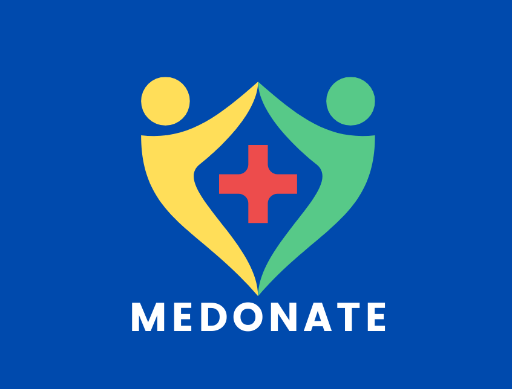
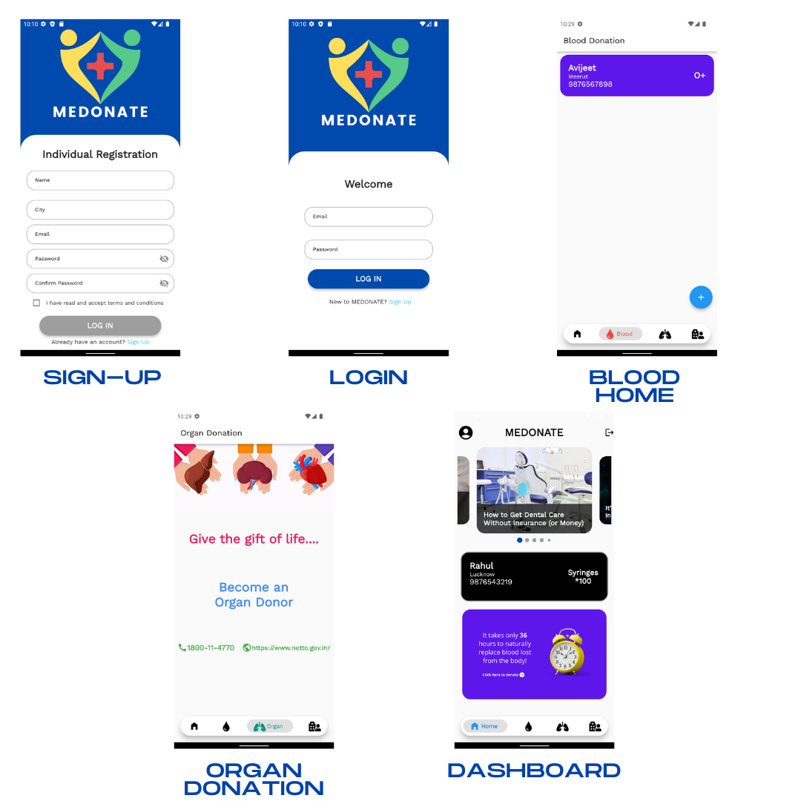

# Chef Gram
## _E-donation application_

Medonate is a flutter based E-management app that can be used across multiple platforms. It implementes blood, equipment donation and requests inside
application and user notification system using in-app mailing system. It also raises awarness regarding organ donation to users.

Here are the key features in detail:

⭐ Request blood & equipment easily

⭐ Get notified about pending requests directly using mail

⭐ User profile analysis

⭐ Easy to use & understand UI/UX

## Tech

## Plugins
  - cupertino_icons: ^1.0.2
  - cupertino_icons: ^1.0.2
  - sizer: ^2.0.13
  - flutter_svg: ^0.22.0
  - shared_preferences: ^2.0.7
  - google_nav_bar: ^5.0.5
  - provider: any
  - carousel_slider: ^4.0.0
  - dio: ^4.0.0
  - transparent_image: ^2.0.0
  - smooth_page_indicator: ^1.0.0+2
  - url_launcher: ^6.0.12
  - webview_flutter: ^2.1.1
  - firebase_auth: ^3.1.2
  - firebase_core: ^1.7.0
  - cloud_firestore: ^2.5.3
  - font_awesome_flutter: ^9.2.0
  - flutter_slidable: ^0.6.0
  - flutter_email_sender: ^5.0.2
  
## Contributing

Contributing to Medonate is easy. Look out for issues and submit a pull request.

Please read [`CONTRIBUTING`](CONTRIBUTING.md) for the process for submitting pull requests to us.

## Getting Started

This project is a starting point for a Flutter application.

A few resources to get you started if this is your first Flutter project:

- [Lab: Write your first Flutter app](https://flutter.dev/docs/get-started/codelab)
- [Cookbook: Useful Flutter samples](https://flutter.dev/docs/cookbook)

For help getting started with Flutter, view our
[online documentation](https://flutter.dev/docs), which offers tutorials,
samples, guidance on mobile development, and a full API reference.

### Screenshots 📱

